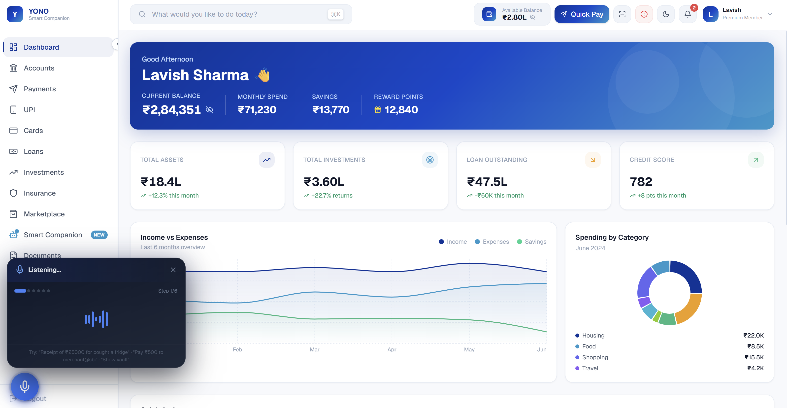

# SBI Smart Companion

A Next.js based web application for the SBI Hackathon. It features an AI-powered voice assistant capable of navigating the banking dashboard, managing personal documents in a Smart Vault, forecasting affordability, and auto-filling loan applications using voice commands.

## Features

- Voice-Activated Navigation: Navigate through the banking dashboard using natural language commands.
- Smart Vault: Automatically organizes bills, receipts, and personal KYC documents.
- Voice Biometrics: Secure sensitive actions (like increasing UPI limits) using a voice passphrase.
- Transaction Querying: Ask questions about your spending and the agent will sum it up based on your vault receipts.
- Smart Form Auto-fill: Extract data from documents stored in the Smart Vault to fill out loan applications automatically.

## Tech Stack

- Framework: Next.js (React)
- Styling: Tailwind CSS
- Voice Agent: Web Speech API (SpeechRecognition and SpeechSynthesis)
- Persistence: LocalStorage (Offline-capable)

## Local Development

The project is split into a frontend and a backend folder. The voice agent and the core features rely entirely on the frontend application.

1. Navigate to the frontend directory:
   cd frontend

2. Install dependencies:
   npm install

3. Run the development server:
   npm run dev

4. Open the application in Google Chrome or Microsoft Edge (Voice features require a Chromium-based browser).
   Note: Once deployed, you will use the live Vercel URL instead of localhost.

## Deployment

This application is ready to be deployed to Vercel without any additional environment variables.

1. Import the repository in Vercel.
2. Important: Set the "Root Directory" to `frontend` in the project settings.
3. Click Deploy.

The Vercel deployment will automatically seed the Smart Vault with demo receipts and KYC documents on the first visit so the application is ready for demonstration immediately. Please ensure you demonstrate the live URL in Google Chrome or Microsoft Edge.
